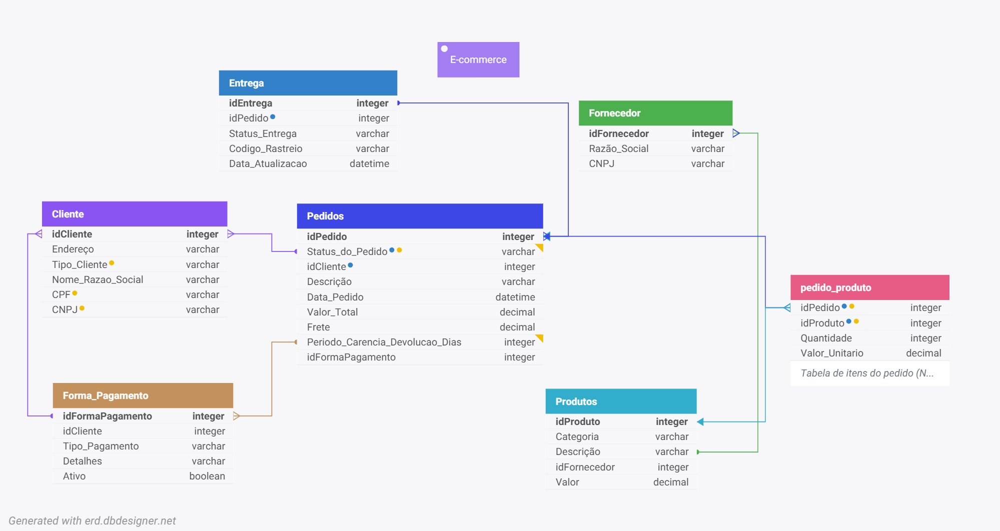

# E-commerce Data Pipeline e Analytics

O objetivo deste projeto não é apenas hospedar código, mas sim servir como um **Guia Didático** completo sobre como os dados saem de uma transação web e se transformam em decisões de negócio em um Data Warehouse de nível de produção.

---

## A Arquitetura e as Fases do Projeto

O projeto simula um E-commerce e foi dividido em 5 grandes pilares. Vamos passar por cada um deles para entender o *porquê* das decisões técnicas tomadas.

### 1. Modelagem Relacional (OLTP)
Foi estruturada uma base de dados transacional (**PostgreSQL**) focada em alta disponibilidade.
Foi criada, então, a modelagem relacional aplicando conceitos de **Chaves Primárias (PK)** e **Chaves Estrangeiras (FK)** para garantir a *Integridade Referencial*. Isso significa que o banco impede anomalias, como um pedido ser pago com um cartão inexistente.



### 2. Geração de Dados Sintéticos e Faker
Para simular a realidade respeitando a LGPD, utilizou-se a biblioteca `Faker` no script `gen_seed.py`. 
Assim, foi gerado instantaneamente **50.000 pedidos** vinculados a milhares de clientes, cartões de crédito e produtos fictícios.

> **Utilizando o Seed:** Foi utilizado `Faker.seed(42)` no código. Ao fixar essa semente matemática, se garante a **reprodutibilidade**. Qualquer pessoa que clonar este repositório vai gerar exatamente os mesmos clientes e CPFs, mantendo o ambiente de testes padronizado.

### 3. APIs e Comunicação Moderna (Mock API)
Foi construída uma *Mock API* usando o framework **FastAPI** para expor os dados. O FastAPI funciona como um garçom, servindo os dados de faturamento do E-commerce no formato `JSON` para os scripts ETL. Todo esse fluxo foi testado previamente usando o **Postman** e iterando no código localmente.

### 4. ETL e Idempotência
Na hora de trazer os dados da API para o Data Warehouse (na Camada RAW), foram criados scripts em python (`ingest_api.py` e `ingest_csv.py`) com um conceito chamado **Idempotência**.
Imagine que um script falhe na metade ou rode duas vezes. Ele vai duplicar a receita da empresa? Não. Utiliza-se, então, a cláusula `UPSERT` (ON CONFLICT DO UPDATE) do banco de dados (que foi gerenciada através do **pgAdmin**):
```sql
INSERT INTO raw_pedidos (id_pedido, valor_total...)
VALUES (...)
ON CONFLICT (id_pedido) DO UPDATE SET valor_total = EXCLUDED.valor_total;
```
Isso garante que o script possa rodar mil vezes e ele apenas atualizará os registros, **nunca duplicando os dados**. Esse fluxo foi valiado automatizando testes automatizados com o **Pytest**.

### 5. Extraindo valor através da análise dos dados
Com os dados seguros no DW, a análise foi realizada utilizando:
- **Pandas**: Usado para limpar, tratar inconsistências, formatar datas e fazer cruzamentos (JOINs) massivos em memória, tudo documentado dentro de Jupyter Notebooks.
- **Matplotlib & Seaborn**: Usados para traduzir os números em visuais e dashboards descobrindo tendências como a *Evolução da Receita Mensal* e o *Ticket Médio por Categoria*.

---

## Estrutura do Projeto

A organização de pastas foi desenhada seguindo as boas práticas da engenharia de software e pipelines de dados:

```text
📦 ecommerce-pipeline
 ┣ 📂 db                   
 ┃ ┣ 📂 ddl                  
 ┃ ┗ 📂 seed                
 ┣ 📂 docs                 
 ┃ ┣ 📂 analytics         
 ┃ ┣ 📜 er-modelo.md       
 ┃ ┗ 📜 er-modelo.png       
 ┣ 📂 ingestion             
 ┃ ┣ 📜 ingest_api.py       
 ┃ ┗ 📜 ingest_csv.py      
 ┣ 📂 mock_api             
 ┃ ┗ 📜 main.py           
 ┣ 📂 scripts          
 ┃ ┣ 📜 gen_seed.py        
 ┃ ┗ 📜 requirements.txt   
 ┣ 📂 tests              
 ┃ ┗ 📜 test_ingest.py    
 ┣ 📜 .env.example     
 ┣ 📜 .gitignore             
 ┗ 📜 README.md
```

---

## Como Executar o Projeto Localmente

Siga o passo a passo abaixo para rodar esse projeto.

### 1. Preparando o Ambiente Python
Certifique-se de usar Python 3.10 ou superior:
```bash
python -m venv .venv

# Ative no Windows:
.venv\Scripts\activate
# Ative no Mac/Linux:
source .venv/bin/activate

pip install -r scripts/requirements.txt
```

### 2. Configurando o Banco de Dados
O projeto não expõe senhas abertamente (Segurança acima de tudo).
1. Crie um arquivo oculto chamado `.env` na raiz do projeto, copiando e editando os valores do arquivo de modelo `.env.example`.
2. No seu servidor local PostgreSQL (utilizando ferramentas como o pgAdmin ou terminal), crie um banco de dados limpo executando:
   `CREATE DATABASE ecommerce_db;`
3. Rode os seguintes schemas:
```bash
psql -U postgres -d ecommerce_db -f db/ddl/001_schema_inicial.sql
psql -U postgres -d ecommerce_db -f db/ddl/002_schema_raw.sql
```

### 3. Simulando a Geração de Dados
Execute o comando abaixo para acionar a biblioteca Python `Faker`, gerando massas sintéticas e dados demográficos para milhares de registros simulados:
```bash
python scripts/gen_seed.py
```

### 4. Executando a Pipeline de Ingestão (ETL)
Você tem duas opções disponíveis para trazer os dados da fonte original até o Data Warehouse (Camada Raw).

**Opção A: Ingestão de CSV Nativa**
Para ingestões em bulk com os arquivos gerados:
```bash
python -m ingestion.ingest_csv
```

**Opção B: Ingestão via API (Simulando uma Integração de Sistemas)**
Primeiro, vamos acordar o garçom. Suba a Mock API disparando este comando através do terminal:
```bash
uvicorn mock_api.main:app --reload
```
Em seguida, deixe esse rodando e em *outro* terminal novinho, dispare a carga HTTP:
```bash
python -m ingestion.ingest_api
```

### 5. Validando a Qualidade e a Segurança
Como prova real de qualidade do código, rode a suite automatizada e deixe o Pytest atestar se os dados se mantêm únicos e corretos:
```bash
pytest tests/
```

---

## Conclusão
Neste projeto, transitou-se livremente entre bases como Governança, Leis de Privacidade e Modelagem, mecânica via APIs, arquitetura relacional e Upsert e Notebooks para Visualizações Analíticas. 
