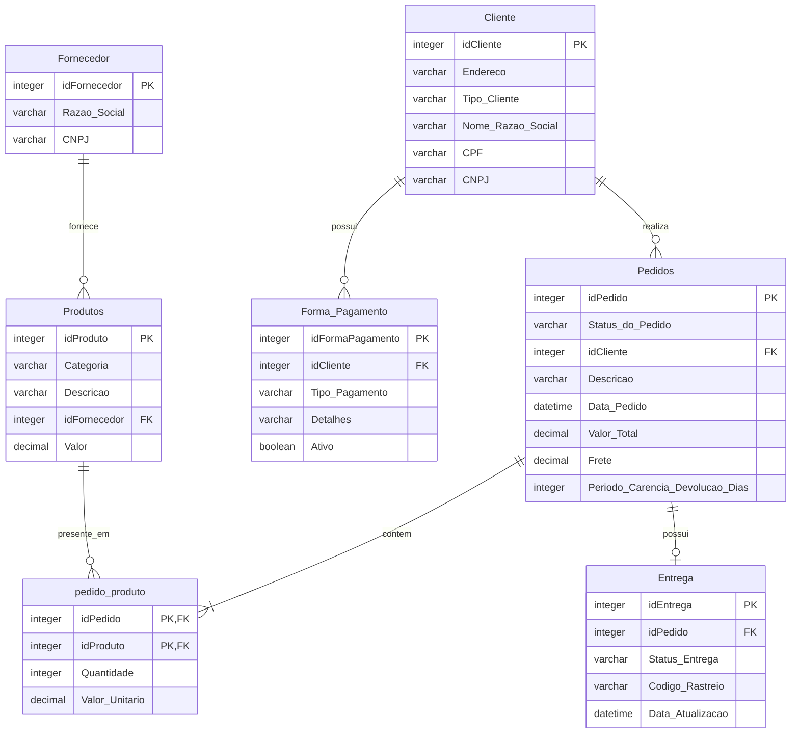

# E-commerce Data Pipeline & Analytics

Este repositório contém a modelagem, simulação de dados e **camada de ingestão/DW** para um e-commerce fictício. O pipeline simula desde o transacional (OLTP) através de uma **Mock API** e base de dados, até a extração, carga (Raw Layer) com **Idempotência**, analytics exploratório e testes automatizados.

## Modelagem de Dados (ER)

O projeto foi construído sobre uma base relacional de E-commerce, garantindo a integridade dos dados através de Chaves Primárias (PK) e Estrangeiras (FK). Abaixo está a arquitetura transacional (OLTP) do modelo:



## O que está neste repositório

- `db/ddl/001_schema_inicial.sql`
  - modelagem relacional do transacional (PK/FK).
- `db/ddl/002_schema_raw.sql`
  - tabelas para a camada RAW do Data Warehouse (landing zone).
- `db/seed/`
  - arquivos CSV de amostra (Seed) e script de carga (`load_seed.sql`).
- `mock_api/main.py`
  - API Rest (FastAPI) servindo dados JSON dos pedidos e clientes para simulação OLTP.
- `ingestion/`
  - `ingest_csv.py`: carga nativa batch de arquivos CSV aplicando Idempotência (Upsert).
  - `ingest_api.py`: carga de dados consumidos da API via requests HTTP (também idempotente).
- `tests/test_ingest.py`
  - suite de testes em `pytest` garantindo reexecução sem duplicação de chave natural.
- `docs/analytics/`
  - notebook completo exploratório, notebook de ETL e dashboard web em html.
- `scripts/gen_seed.py`
  - script gerador base de massas sintéticas com Faker.

---

## Como Executar

### 1. Instalar dependências
Certifique-se de usar Python 3.10+:
```bash
python -m venv .venv
.venv\Scripts\activate
pip install -r scripts/requirements.txt
```

### 2. Gerar os arquivos sintéticos localmente
Isso vai gerar os CSVs atualizados dentro de `db/seed/`.
```bash
python scripts/gen_seed.py
```

### 3. Preparar o banco de dados e os Schemas (Transacional e DW)
1. No seu servidor PostgreSQL, crie o banco vazio: `CREATE DATABASE ecommerce_db;`
2. No seu terminal de preferência, rode os DDLs:
```bash
psql -U postgres -d ecommerce_db -f db/ddl/001_schema_inicial.sql
psql -U postgres -d ecommerce_db -f db/ddl/002_schema_raw.sql
```

### 4. Rodar a Ingestão de Dados via Scripts
Para popular o Data Warehouse usando lógica Idempotente (ON CONFLICT DO UPDATE):
```bash
python -m ingestion.ingest_csv
```

### 5. Simular Ingestão via API
Primeiro suba a API Mock local num terminal:
```bash
uvicorn mock_api.main:app --reload
```
Em um *outro* terminal, rode a ingestão HTTP:
```bash
python -m ingestion.ingest_api
```

### 6. Rodar Suite de Testes de Qualidade e Idempotência
```bash
pytest tests/
```
Se a suite de testes rodar verde (passed), significa que a idempotência impediu duplicações caso os scripts rodem mais de uma vez.

---

## Git e Versionamento

O controle de versão deste repositório foi organizado para ser claro e demonstrar organização de código:
- **Commits Descritivos**: Os commits indicam claramente a alteração técnica (ex: `feat: cria arquitetura raw e mock api`).
- **Uso de Branches**: As novas camadas do projeto foram construídas em branches isoladas (ex: `feat/ingestao`) e depois integradas, para não quebrar a linha principal de produção.

---

## Conclusão

Este projeto consolida conhecimentos fundamentais de **Engenharia e Análise de Dados** aplicados a um cenário do mundo real.

Assim, foi buscado percorrer o ciclo de vida completo de uma pipeline de dados: começando ao projetar a modelagem relacional de um E-commerce, simulando a geração de dados com segurança (LGPD), consumindo essas informações tanto por CSV quanto por uma API Mock em tempo real, e estruturando um ambiente escalável no banco de dados usando scripts idempotentes e testes automatizados. Por fim, foi extraído valor dessas informações através de métricas de vendas, painéis e análises em Python.

É um reflexo prático de um Data Warehouse funcional, focado na governança de dados e em métricas de negócio.

## Arquitetura de Idempotência
A camada de ingestão utiliza a chave natural (ex: `id_pedido`, `id_cliente`) através do recurso:
`ON CONFLICT (chave) DO UPDATE SET...`
Isso garante que se os scripts de carga rodem acidentalmente várias vezes, eles não irão poluir ou duplicar os dados da camada RAW, atualizando apenas o que for realmente necessário.