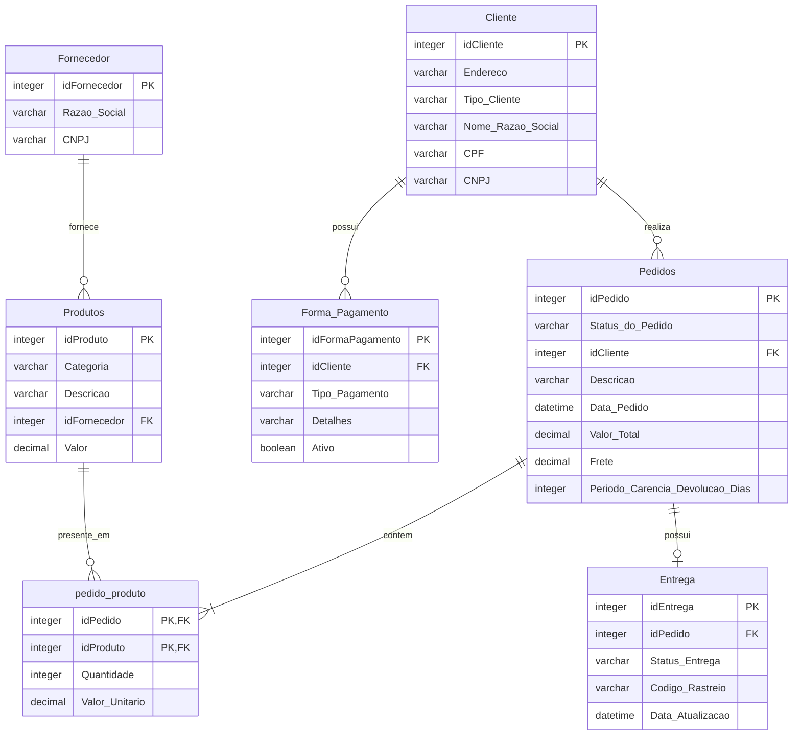

# Modelo de Entidade Relacionamento (ER)

Abaixo está o diagrama ER do Ecommerce Pipeline, representando as tabelas, chaves primárias e estrangeiras e suas cardinalidades.

```mermaid
erDiagram
    Cliente ||--o{ Pedidos : "realiza"
    Cliente ||--o{ Forma_Pagamento : "possui"
    
    Pedidos ||--|{ pedido_produto : "contem"
    Produtos ||--o{ pedido_produto : "presente_em"
    
    Fornecedor ||--o{ Produtos : "fornece"
    Pedidos ||--o| Entrega : "possui"

    Cliente {
        integer idCliente PK
        varchar Endereco
        varchar Tipo_Cliente
        varchar Nome_Razao_Social
        varchar CPF
        varchar CNPJ
    }

    Pedidos {
        integer idPedido PK
        varchar Status_do_Pedido
        integer idCliente FK
        varchar Descricao
        datetime Data_Pedido
        decimal Valor_Total
        decimal Frete
        integer Periodo_Carencia_Devolucao_Dias
    }

    Produtos {
        integer idProduto PK
        varchar Categoria
        varchar Descricao
        integer idFornecedor FK
        decimal Valor
    }

    Fornecedor {
        integer idFornecedor PK
        varchar Razao_Social
        varchar CNPJ
    }

    pedido_produto {
        integer idPedido PK, FK
        integer idProduto PK, FK
        integer Quantidade
        decimal Valor_Unitario
    }

    Forma_Pagamento {
        integer idFormaPagamento PK
        integer idCliente FK
        varchar Tipo_Pagamento
        varchar Detalhes
        boolean Ativo
    }

    Entrega {
        integer idEntrega PK
        integer idPedido FK
        varchar Status_Entrega
        varchar Codigo_Rastreio
        datetime Data_Atualizacao
    }
```
